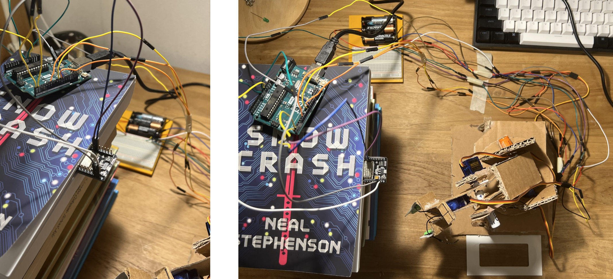

# computer_vision_controlled_robotic_arm
## Introduction
This project enables a robotic arm to autonomously manipulate objects using ESP32 camera for real-time object detection and Arduino Uno for servo motor controls. 

## Features
- Calculation of joint angles using inverse and forward kinematics
- Serial communication between Python and Arduino for data exchange
- Control of servo motors to move the robotic arm
- Calibration of the ESP32 camera for accurate 2D-to-3D coordinate conversion
- Real-time object detection using pretrained YOLOv3 weights
  
## Hardware Setup
- **ESP32 Camera**: Positioned in a bird's eye view to provide a real-time video stream for object detection. 
- **Arduino Uno**: Serves as the controller for the servo motors, receiving joint angles data from Python and sending status updates back to Python. 
- **Servo Motors**: Control the movements of the robotic arm based on the computed joint angles. 
- **3-DoF Robotic Arm**: A custom-built prototype assembled using upcycled materials to promote sustainability. 

### Image of Hardware Connections 


## Software Setup
### **1. ESP32 Camera Setup**
The ESP32 camera is configured using the **CameraWebServer** example code from the ESP32 library, enabling video streaming accessible via a specific IP address. 

### **2. Object Detection with YOLOv3**
- **Pretrained YOLOv3 Weights**: Utilizes pretrained YOLOv3 weights and COCO classes for object detection.
- **Bounding Box and Non-Maximum Suprression**: After detecting object, redundant boxes are removed by NMS, and the most optimal bounding box is drawn around the identified object in the camera feed.

### **3. Kinematics**
- **Inverse Kinematics**: Applies geometric approach to calculates the joint angles required for the robotic arm to reach a specific 3D position of the object. 
- **Forward Kinematics**: Uses modified Denavit-Hartenberg (DH) parameters to verify that the computed joint angles correctly map to the desired 3D coordinates.

### **4. Serial Communication**
- **Python-Arduino Communication**: The Python script sends joint angles data to the Arduino, which interprets the data and moves the servo motors accordingly. 
- **Synchronization**: The Arduino updates the status after completing the servo motors movements. Communication is synchronized using a **handshaking system**, ensuring smooth data exchange.

### **5. Servo Motor Control**
- **VarSpeedServoLibrary**: Leverages the VarSpeedServo library to control the speed of servo motors, ensuring smooth movement and maintaining strcutural stability. 

## Installation  
### **1. Clone the Repository**  
```bash
git clone https://github.com/bitwizd03/computer_vision_controlled_robotic_arm.git
cd robotic-arm-computer-vision
```
### **2. Install Dependencies**
- **Python**: Install the necessary Python libraries using pip:
```bash
pip install numpy opencv-python pyserial sympy
```
- **Arduino**:
  1. Open the Arduino IDE and install the ESP32 library by Espressif from the Library Manager.
  2. Download the VarSpeedServo library from [github](https://github.com/netlabtoolkit/VarSpeedServo) as a ZIP file.
  3. Upload the ZIP file to the Arduino IDE using Sketch > Include Library > Add .ZIP Library

### **3. ESP32 Camera Setup** 
- Open the CameraWebServer example code in the Arduino IDE and update the code with your local Wi-Fi network name and password.
- For detailed settings and connections, refer to this [video tutorial](https://www.youtube.com/watch?v=7-3piBHV1W0)! 

### **4. Run the Python Script**
- Modify the forward_kinematics code to include your robotic arm's modified DH parameters 
- Update the serial_communication code with your local Arduino port
- Change the video_streaming, pixel_coordinates and object_detection code to match the IP address of your ESP32 camera. 
- Run the scipt to begin object detection, calculate joint angles, and control the robotic arm:
```bash
python main.py
```
## Results
Stable Structure, Smooth Movements, Object Detection trhough ESP32 Camera, and Precise 2D-to-3D Coordinate Conversion
[](https://youtu.be/zEXQ5RJERkk?si=OxOXtrxkvkzXIVPO)

## Future Improvements 

## Acknolwedgements


